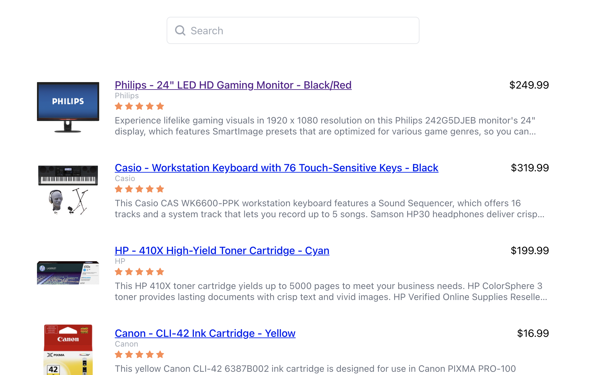
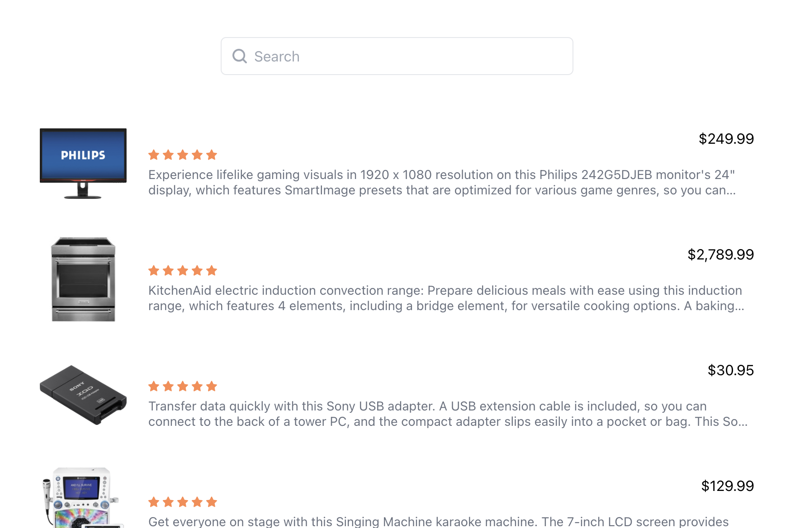

## Guide: Getting started with the Sajari React SDK

This guide will teach you how to set up a new application from scratch
with [Create React App](https://github.com/facebook/create-react-app) and
the [Sajari React SDK](https://github.com/sajari/sdk-react).



To check out the completed app, you can either:

1. Clone the repository and check out this branch
2. Fork the sandbox under https://codesandbox.io/s/sajari-sdk-react-getting-started-lk6v2

### 1. Create a new react app

```bash
npx create-react-app sajari-app
cd sajari-app
npm start
```

This will create your frontend app. For more details on create-react-app take a look at
the [React documentation](https://reactjs.org/docs/create-a-new-react-app.html).

### 2. Install the Sajari Search UI package

> The Sajari Search UI provides easy to use search components to quickly build a beautiful search interface. Let's run through building an example UI using the @sajari/react-search-ui package.

Install the package using `yarn add` or `npm install`, we will use Yarn to install the `react-search-ui` package

Stop the react app if it is running and run the following command in the terminal

```bash
yarn add @sajari/react-search-ui
```

### 3. Add the SearchProvider

The [SearchProvider](https://react.docs.sajari.com/hooks/searchprovider) should be used as a wrapper for the entire
application to provide a way to share application state between hooks, for example, the current query, active filters or
the search response.

Wrap the React App with the `SearchProvider`.

To do this, navigate to the `src` directory within your preferred IDE and edit the `index.js` file as described below:

```javascript
/* index.js */

import { SearchProvider } from "@sajari/react-search-ui";

ReactDOM.render(
  <SearchProvider>
    <App />
  </SearchProvider>,
  document.getElementById("root")
);
```

Start the app with `npm run start`

Now we should see the following error message:

❌ TypeError: Cannot read property 'pipeline' of undefined

Although we have wrapped the app in our search provider, we have not configured the Sajari Pipeline to search.

### 4. Configure the Search Pipeline

We need to tell the search provider which account, collection and pipeline to use for the search. The account is our
Sajari account, the collection is where our data is stored and the pipeline specifies the search configuration.

For this guide we will use a Sajari demo account. At the top of the `index.js` file we will import the Pipeline class
and configure our pipeline.

> Replace the **account**, **collection** and the **pipeline** name (here it is _query_) with your own collection details to search your data instead of using our demo dataset.

```javascript
/* index.js */

import { Pipeline, SearchProvider } from "@sajari/react-search-ui";

const pipeline = new Pipeline(
  {
    account: "1594153711901724220",
    collection: "bestbuy",
  },
  "query"
);
```

Next we need to pass the pipeline configuration to the SearchProvider like so:

```javascript
/* index.js */

<SearchProvider
    search={{pipeline}}
    searchOnLoad
>
```

In the above code snippet we’ve passed the `pipeline` configuration to the `search` property. You will also notice that
we’ve added a second property called `searchOnLoad` which will trigger a search on the initial load of
the `SearchProvider` component.

Start up the app via `npm run start` if it isn't already running, and you will see that the error has disappeared.
However, so far we are still only seeing the default React App screen. Let’s add our Search.

### 5. Adding the Search UI

In `App.js` let’s start by deleting the default React landing page by removing the <header> tags and anything in
between.

Next, we important the components we want to use for the UI. Let’s start simple with a search input and the results
component.

```javascript
/* App.js */

import "./App.css";
import { Input, Results } from "@sajari/react-search-ui";

function App() {
  return (
    <div className="App">
      <div className="search-bar">
        <Input />
      </div>
      <div className="results">
        <Results />
      </div>
    </div>
  );
}

export default App;
```

Note that we added a couple of divs around the `Input` and the `Results` component to add some styling, let’s do that
quickly.

Replace the entire content in `App.css` with the following:

```css
/* App.css */

.search-bar {
  margin: 50px auto;
  max-width: 600px;
}

.results {
  padding: 20px;
  text-align: left;
  max-width: 1200px;
}
```

Now you should see a search input field and results when loading the app. Note that the results are likely to differ
from what is shown below.

The search is now fully functional. Try searching for watches or laptops or other products.



This looks great, but the eagle eyed will have noticed that we are missing the title field for our products.

### 6. Mapping fields

Because the field is not called title in our dataset but name, we will have to map the fields. Luckily it’s really easy
to map the fields using the FieldDictionary class.

Similar to the pipeline configuration earlier, we will create
a [FieldDictionary](https://react.docs.sajari.com/classes/fielddictionary) and pass it into the SearchProvider.

We import the FieldDictionary class and add the following:

```javascript
/* index.js */

import {
  FieldDictionary,
  Pipeline,
  SearchProvider,
} from "@sajari/react-search-ui";

const fields = new FieldDictionary({
  title: "name",
  subtitle: "brand",
});
```

Here we simple mapped the `title` property to the schema field with the name `name` and the `subtitle` property to the
schema field with the name `brand`.

Lastly, we pass the `FieldDictionary` we defined above into the `SearchProvider`’s `search` property like so:

```javascript
/* index.js */

<SearchProvider
    search={{pipeline, fields}}
    searchOnLoad
>
```

Let’s take another look at our app:


Now we can see the name of each product, and the subtitle displays the brand as specified in the FieldDictionary.

### 7. Adding filters

Filters are just as easy to add as mapping fields. To do so, use the `FilterBuilder` to create a filter and pass it to
the `SearchProvider` as part of the `ProviderPipelineConfig` object.

First, let’s import the `FilterBuilder` and define the filter, we want to add a category filter for products. In the
schema, categories are stored in a field called `level1` for the first level of categories, e.g. ..... .

```javascript
/* index.js */

import {
  FilterBuilder,
  FieldDictionary,
  Pipeline,
  SearchProvider,
} from "@sajari/react-search-ui";

const categoryFilter = new FilterBuilder({
  name: "category",
  field: "level1",
});
```

The simplest version of a filter requires a `name` attribute, this can be anything we want, and a `field` which
identifies the field in the schema we want to user for the filter.

Once defined, we pass the filter as part of an array to the `SearchProvider`.

```javascript
/* index.js */

<SearchProvider
    search={{
        pipeline,
        fields,
        filters: [categoryFilter]
    }}
    searchOnLoad
>
```

To add the filter to the UI, all we need to do is import the Filter component to our app frontend and wrap the Filter
and Results components within our `App.js`.

```javascript
/* App.js */

import { Filter, Input, Results } from "@sajari/react-search-ui";

function App() {
  return (
    <div className="App">
      <div className="search-bar">
        <Input />
      </div>
      <div className="container">
        <div className="filters">
          <Filter type="list" name="category" title="Category" />
        </div>
        <div className="results">
          <Results />
        </div>
      </div>
    </div>
  );
}
```

The `title` defined here will be used as the filter. To ensure the components are properly aligned on the page, we have
added a couple more container divs and add some further styling to the `App.css`.

```css
/* App.css */

.search-bar {
  margin: 50px 400px;
}

.results {
  padding: 20px;
  text-align: left;
  max-width: 1200px;
}
```

To see the full working example that we have made here today checkout the `getting-started` Git branch.

### Summary

Building a search UI with Sajari and React is very simple. Sajari provides a variety of powerful components to compose
custom search UIs. And for even more flexibility, you can create your own components and use
Sajari’s [Hooks](https://react.docs.sajari.com/hooks) to implement a completely unique search experience on top of
Sajari.

If you have any questions, hit us up in the [community on Github](https://github.com/sajari/community).
