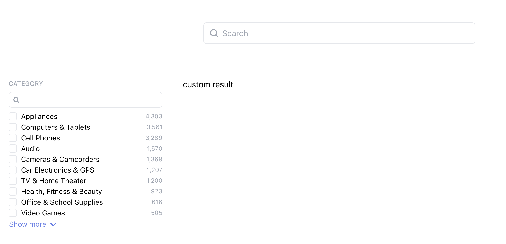
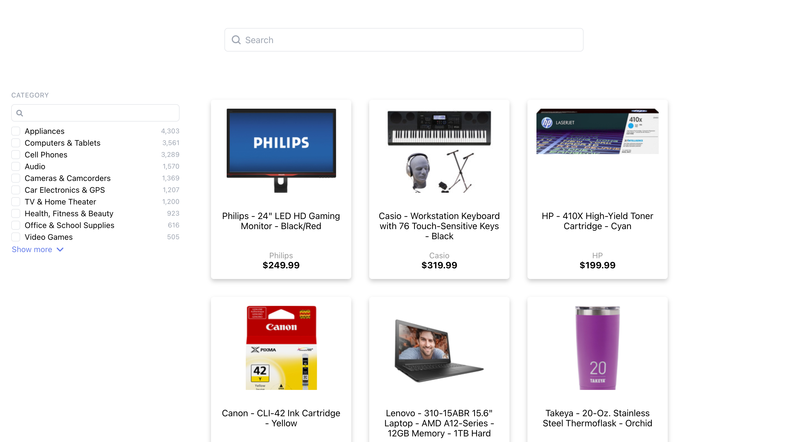

# Guide: Custom Results 

## Introduction

To create a truly unique search experience, [React Hooks]([Hooks documentation](https://react.docs.sajari.com/hooks) allow you to use your own components while hooking into the state of Sajari's search provider.

In this guide we are customising the products shown in the search results. 

### Getting started

### Install

Install the React Hooks via yarn or npm install.

```yarn add @sajari/react-hooks```

### Create the custom result component 

First, create a new directory for your custom component under the `src` directory. Call it the directory `components`.

Create a new file in the `components` directory called `custom-results.js`. Add the following code: 

```javascript
/*  custom-results.js */ 

import * as React from "react";
import { useSearch } from '@sajari/react-hooks';

function CustomResults(){
    return (
    <div>
        custom result
    </div>
    );
}

export default CustomResults;
```

We just created a very basic version of our custom result. Let's use it instead of the default Results component. In `App.js` import the new component. 

```
import CustomResults from "./components/custom-result";
```
Now find and replace `<Results />` with `<CustomResults />`. Start the app with `yarn start`, you should see something similar to the following screen. 



Congratulations, you just rendered your first custom component!

### Hooking into `useSearch`

Next, we want to access the search results once a search is being executed. To do so, add the following to the beginning of the custom hook function: 

`  const { results = [] } = useSearch();`

The useSearch hook provides a way to perform a search using the current context or a custom one-off search. It returns results for the current query. By default, it will use the Variables and Pipeline from the context. In the line above, we are adding the search results to the results array const.

To test it, let's replace our placeholder text and check the size of the result

```
return (
<div>
    {results.length}
</div>
);
```

You should see the placeholder text replaces with the number of results returned, which in this case is **15**. 

### Iterating over the results 

Now that we have access to the results, all we need to do is iterate over them and use the data in the custom result component we've created. 

To do this we will use the `Array map()` method which takes a function as an argument. 

```javascript
 return (
    <div class="results">
        {results.map(renderResult)}
    </div>
);
```

Let's call the function we are passing to the map method `renderResult`. Next up we add that function to the component. Above the return, add the following: 

```javascript
 function renderResult(result) {
    const values = result.values
    return (
        <div className="card">
                <div className="result-image" >
                    
                </div>
                <div className="result-description">
                    <div className="result-name">
                        <h3>
                            {values.name}
                        </h3>
                    </div>
                    <div className="result-brand">{values.brand}</div>
                    <div className="result-price">${values.price}</div>
                </div>
            <div className="buy-button"><Button appearance="primary">Buy now for ${values.price}</Button></div>
        </div>
    )
}
```

To make it easier to refer to the values throughout this function, we are assigning the values map to the `const values` variable.

Let's create our custom result. In this example we've added a "Buy now..." button that appears on hover. But you can also add lozenges, or a like button. Implement whatever amazing design you can imagine, creating our own component gives you complete freedom. 

You can access the fields in the result via `{values.[schema-field]}`.

>  Website collections only return the title, url and description by default. To get access to all fields, add the [variables attribute](https://react.docs.sajari.com/classes/variables) with the following configration to the [SearchProvider](https://react.docs.sajari.com/search-ui/searchprovider) `variables: new Variables({fields: ""})`.

Lastly, to ensure the results look good, replace the content of the `App.css` file with the following styles. We won't get into the details of the styles here.  

```css
.search-bar{
  margin: 50px 400px ;
}
.container {
  display: flex;
}
.filters{
  flex-basis: 300px;
  min-width: 300px;
  padding:20px;
}
.card {
  /* Add shadows to create the "card" effect */
  box-shadow: 0 4px 8px 0 rgba(0,0,0,0.2);
  transition: 0.3s;
  max-width: 250px;
  border-radius: 5px;
  margin: 1em;
  width: 250px;
  position: relative;
}
/* On mouse-over, add a deeper shadow */
.card:hover {
  box-shadow: 0 8px 16px 0 rgba(0,0,0,0.2);
}
.buy-button{
  display: none;
  position: absolute;
  margin-left: auto;
  margin-right: auto;
  left: 0;
  right: 0;
  text-align: center;
  bottom: 15px;
}
.card:hover .buy-button {
  display: block;
}
.results{
  padding:20px;
  text-align: left;
  max-width: 1600px;
  display: flex;
  flex-flow: wrap;
}
.result-description h3{
  margin-top:0;
  font-size: 1em;
  text-align: center;
  text-overflow: ellipsis;
  font-weight: normal;
}
.result-name{
  height:55px;
  overflow: hidden;
  text-overflow: ellipsis;
  margin-bottom: 1em;
}
.result-image{
  margin: 1em;
  height: 150px;
  overflow: hidden;
}
.result-image img{
  display: block;
  margin-left: auto;
  margin-right: auto
}
.result-description{
  display: grid;
  margin:2em 1em 1em 1em;
  text-align: center;
}
.result-brand{
  font-size: 0.875em;
  color:#999;
}
.result-price{
  font-weight: bold;
}
```




## 🎉 Congratulations, you've created a custom result component!

